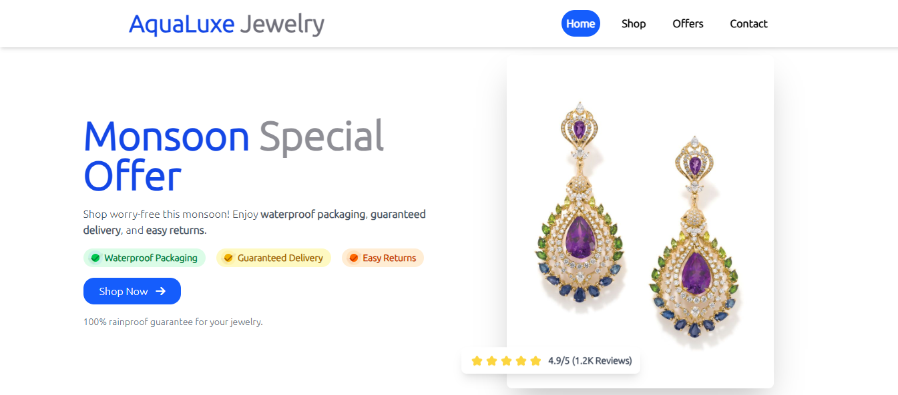

# Assesment Submission

<strong> Submitted By: </strong> Raktim Maity

# Problem Statements
### 1. Three creative reasons for ROAS drop
 - In the situation of heavy rains peoples or customers fear for delivery delays or damaged products due to water exposure.
  
 <strong>For Example,</strong> Jewlery is a costly item for that customers expect that the item will deliverd quickly means on-time delivery and also safe delivery.

 - In the season Monsoon months have fewer weddings, parties or some outdoor events. In this time jewelry demand is very high. Because, there were many festivals were happen like Durga Puja, Diwali etc.

 - In the season of Monsoon it affects the network connectivity thats why their are some issues were occured like slow page loads, failed transactions etc. 
 
<strong>For Example,</strong> If a customer or user can't load the page and view the product or pay the amount smoothly, they actually would not complete the purchase.

#

### 2. Landing Page (React/Tailwind CSS)
- ✨ Features
 
✅ Rainy Day Guarantee: Free resecheduling if it rains!,
 
✅ Trust Badges,
 
✅ Call to Action (CTA) – "Shop Now" Button,
 
✅ Minimalist & Mobile-Friendly – Ensures fast loading. Here i use the lazy loading functionality.

#### 🌐 Live Demo
- 🔗 **Hosted Link:** [Demo](https://aqualuxejewelry-raktimmaitys-projects.vercel.app/)

#### 🚀 Technologies Used
- **React.js**
- **Tailwind CSS**

## Screenshots

#

### 3. 100-Word Client Email for Safe Delivery Solution
Subject: Fixing Monsoon ROAS Drop – Safe Delivery Solution

Hi User,

We have identified three key reasons why your Google Ads ROAS drops during monsoons. The main reasons are delivery fears, mobile network issues, and seasonal interest shifts.

So, after that what is our Solution? So, We built a Monsoon Special Landing Page with a Rainproof Jewelry Guarantee, trust-based messaging, and a floating customer review badge to boost conversions.

Additionally, we’ll run an A/B test comparing urgency-based messaging (Limited stock!) vs. assurance-based (Safe delivery guaranteed!).

Let’s discuss further!

Best Regards,
 
Raktim Maity
#